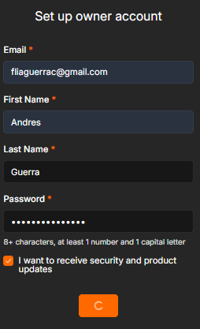
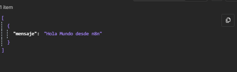

# 🚀 Actividad Práctica — Instalación de n8n y Primer "Hola Mundo"

## 📋 Información del Proyecto

| Campo | Detalle |
|-------|---------|
| **Estudiante** | Andres Guerra |
| **Correo** | fliaguerrac@gmail.com |
| **Método de instalación** | Opción 1 — n8n Local con npm |
| **Versión de n8n** | 2.22.4 |
| **Sistema Operativo** | Windows |

---

## 📌 Requisitos Previos

Antes de instalar n8n de forma local, es necesario contar con los siguientes componentes:

| Requisito | Versión utilizada | Descripción |
|-----------|-------------------|-------------|
| **Node.js** | v18 o superior (LTS) | Entorno de ejecución de JavaScript necesario para ejecutar n8n |
| **npm** | Incluido con Node.js | Gestor de paquetes para instalar n8n globalmente |
| **Navegador web** | Cualquier navegador moderno | Para acceder a la interfaz de n8n en `localhost:5678` |
| **Terminal / CMD** | PowerShell o CMD | Para ejecutar los comandos de instalación y arranque |

> **Nota:** Python 3 no es un requisito obligatorio, aunque n8n muestra un aviso si no está instalado. Esto solo afecta al Task Runner interno de Python, que no es necesario para el funcionamiento básico de la herramienta.

---

## 🔧 Proceso de Instalación

### Paso 1 — Verificar Node.js y npm

Primero se verificó que Node.js y npm estuvieran instalados correctamente ejecutando los siguientes comandos en la terminal:

```bash
node -v
npm -v
```

### Paso 2 — Instalar n8n de forma global

Se procedió a instalar n8n globalmente utilizando npm:

```bash
npm install n8n -g
```

Este comando descarga e instala n8n junto con todas sus dependencias de forma global en el sistema, lo que permite ejecutarlo desde cualquier directorio.

### Paso 3 — Iniciar n8n

Una vez finalizada la instalación, se inició n8n con el siguiente comando:

```bash
n8n start
```

Al ejecutar este comando, n8n realizó las siguientes acciones automáticamente:

- Ejecutó las migraciones de base de datos necesarias
- Registró el Task Broker en `127.0.0.1`, puerto `5679`
- Registró el runner "JS Task Runner"
- Detectó 4 cluster checks
- Registró el cambio de versión a **2.22.4**
- Construyó el índice de dependencias de workflows

Finalmente, la terminal mostró el mensaje:

```
Editor is now accessible via:
http://localhost:5678

Press "o" to open in Browser.
```

📸 **Evidencia — Terminal con n8n iniciado correctamente:**


### Paso 4 — Configurar la cuenta de propietario

Al abrir `http://localhost:5678` en el navegador por primera vez, n8n solicitó la creación de una cuenta de propietario. Se completó el formulario con los siguientes datos:

| Campo | Valor |
|-------|-------|
| Email | fliaguerrac@gmail.com |
| First Name | Andres |
| Last Name | Guerra |
| Password | ••••••••••••••••• |

📸 **Evidencia — Formulario de registro del propietario:**



### Paso 5 — Acceso al Dashboard

Después de completar el registro, se accedió exitosamente al dashboard principal de n8n, donde se muestra el mensaje de bienvenida: **"What do you want to build, Andres"** junto con la opción de **"Build a workflow"**.

También se mostró una notificación confirmando que la licencia estaba en camino al correo registrado.

📸 **Evidencia — Dashboard principal de n8n funcionando:**


---

## ⚠️ Problemas Encontrados

### Advertencia: Python 3 no encontrado

Durante el inicio de n8n, la terminal mostró el siguiente mensaje de advertencia:

```
Failed to start Python task runner in internal mode, because Python 3 is missing from this system.
Launching a Python runner in internal mode is intended only for debugging and is not recommended for production.
```

**Solución:** Este aviso no impide el funcionamiento de n8n. Se trata de un componente opcional para ejecutar código Python dentro de los workflows. Para los objetivos de esta actividad (y para la mayoría de los casos de uso básicos), no es necesario tener Python instalado. n8n funciona perfectamente sin él.

### Advertencia de deprecación

La terminal también mostró un `DeprecationWarning` relacionado con la API `util._extend`:

```
(node:15892) [DEP0060] DeprecationWarning: The 'util._extend' API is deprecated. Please use Object.assign() instead.
```

**Solución:** Este es un aviso interno de Node.js sobre una API que será removida en versiones futuras. No afecta el funcionamiento actual de n8n y no requiere ninguna acción por parte del usuario.

---

## 🔄 Workflow "Hola Mundo"

### Descripción del Workflow

Se construyó un workflow básico para verificar el correcto funcionamiento de n8n. El flujo está compuesto por los siguientes nodos:

### Nodo 1 — Manual Trigger (Disparador Manual)

| Propiedad | Valor |
|-----------|-------|
| **Tipo** | Manual Trigger |
| **Función** | Iniciar la ejecución del workflow de forma manual al hacer clic en el botón "Test workflow" |
| **Configuración** | Sin configuración adicional requerida |

Este nodo actúa como el punto de entrada del workflow. A diferencia de otros triggers (como webhooks o cron), este requiere que el usuario inicie la ejecución manualmente, lo cual es ideal para pruebas y aprendizaje.

### Nodo 2 — Edit Fields (Set)

| Propiedad | Valor |
|-----------|-------|
| **Tipo** | Edit Fields (Set) |
| **Función** | Generar un mensaje personalizado de salida |
| **Campo configurado** | `mensaje` = `"Hola Mundo desde n8n"` |

Este nodo permite definir valores personalizados que se pasan como datos de salida. Se configuró un campo llamado `mensaje` de tipo **String** con el valor `"Hola Mundo desde n8n"`.

### Flujo del Workflow

```
[ Manual Trigger ] ──▶ [ Edit Fields (Set) ]
```

El workflow se ejecuta de la siguiente manera:
1. El usuario hace clic en **"Test workflow"**
2. El nodo **Manual Trigger** ("When clicking 'Execute workflow'") se activa e inicia el flujo, pasando **1 item** al siguiente nodo
3. Los datos pasan al nodo **Edit Fields**, que genera el mensaje de salida con **1 item**
4. El resultado se muestra en el panel de ejecución de n8n

📸 **Evidencia — Workflow ejecutado exitosamente mostrando ambos nodos conectados:**


### Pasos para crear el Workflow

1. En el dashboard, hacer clic en **"Build a workflow"**
2. El editor de workflows se abre con un nodo **Manual Trigger** ya incluido
3. Hacer clic en el botón **"+"** a la derecha del trigger
4. Buscar **"set"** en el buscador de nodos y seleccionar **"Edit Fields (Set)"**

📸 **Evidencia — Buscador de nodos al escribir "set":**


5. Configurar el nodo **Edit Fields**:
   - En **Mode** seleccionar: `Manual Mapping`
   - En **Fields to Set**, hacer clic en **"Add Field"**
   - En **Name** escribir: `mensaje`
   - Seleccionar tipo **String**
   - En **Value** escribir: `Hola Mundo desde n8n`
6. Hacer clic en **"Execute step"** o **"Test workflow"** para ejecutar

📸 **Evidencia — Configuración del nodo Edit Fields con el campo `mensaje` y su resultado en el panel OUTPUT:**


### Resultado de la Ejecución (JSON)

Al ejecutar el workflow, el nodo **Edit Fields** generó la siguiente salida en formato JSON:

```json
[
  {
    "mensaje": "Hola Mundo desde n8n"
  }
]
```

📸 **Evidencia — Salida JSON del workflow:**



---

## 📸 Resumen de Evidencias

| # | Captura | Descripción |
|---|---------|-------------|
| 1 |  | Terminal mostrando n8n v2.22.4 iniciado correctamente en `localhost:5678` |
| 2 |  | Formulario de registro de la cuenta de propietario completado |
| 3 |  | Dashboard principal de n8n funcionando con mensaje de bienvenida |
| 4 |  | Buscador de nodos al buscar "set" para agregar Edit Fields |
| 5 |  | Configuración del nodo Edit Fields con el campo `mensaje` y resultado en OUTPUT |
| 6 |  | Workflow completo ejecutado exitosamente con ambos nodos conectados |
| 7 |  | Salida JSON del workflow mostrando `"mensaje": "Hola Mundo desde n8n"` |

---

## 💡 Reflexión Técnica

### 1. ¿Qué fue lo más difícil de la instalación?

La instalación en sí fue bastante sencilla gracias a que npm simplifica todo el proceso con un solo comando. Lo que podría generar confusión al principio son las advertencias que aparecen en la terminal al iniciar n8n (como la de Python 3 faltante y la deprecación de `util._extend`), ya que uno podría pensar que algo está mal. Sin embargo, al investigar, se descubrió que son mensajes informativos que no impiden el funcionamiento de la herramienta.

### 2. ¿Qué ventajas tiene n8n?

- **Open Source y gratuito:** Se puede instalar y usar sin costo alguno en su versión local.
- **Interfaz visual intuitiva:** Permite crear automatizaciones arrastrando y conectando nodos sin necesidad de programar.
- **Gran cantidad de integraciones:** Cuenta con cientos de nodos para conectar con servicios populares como Google, Slack, Telegram, bases de datos, APIs, etc.
- **Flexibilidad:** Permite ejecutar código personalizado (JavaScript/Python) cuando los nodos predeterminados no son suficientes.
- **Self-hosted:** Al instalarlo localmente, los datos permanecen en tu máquina, lo cual es una ventaja en términos de privacidad y seguridad.
- **Comunidad activa:** Tiene una comunidad creciente que comparte workflows y soluciones.

### 3. ¿Qué diferencia encontraron entre Docker y local?

| Aspecto | Instalación Local (npm) | Docker |
|---------|------------------------|--------|
| **Facilidad** | Muy sencilla, un solo comando | Requiere conocer Docker y docker-compose |
| **Requisitos** | Solo Node.js y npm | Docker Desktop instalado y corriendo |
| **Portabilidad** | Depende del entorno local | Altamente portable, funciona igual en cualquier sistema |
| **Producción** | No recomendado para producción | Más cercano a un entorno de producción real |
| **Aislamiento** | Comparte el entorno con el sistema | Corre en un contenedor aislado |
| **Persistencia** | Los datos se guardan en la carpeta del usuario | Se configura con volúmenes de Docker |
| **Ideal para** | Aprendizaje y pruebas rápidas | Despliegues profesionales y equipos |

En resumen, la instalación local con npm es ideal para aprender y experimentar rápidamente, mientras que Docker ofrece mayor estabilidad, aislamiento y es la opción preferida en entornos de producción.

### 4. ¿Para qué casos reales usarían automatización?

- **Notificaciones automáticas:** Enviar alertas por Telegram o Discord cuando ocurre un evento importante (nuevo pedido, error en un sistema, etc.)
- **Sincronización de datos:** Mantener sincronizadas bases de datos, hojas de cálculo de Google Sheets y CRMs automáticamente.
- **Procesamiento de formularios:** Recibir respuestas de formularios y guardarlas automáticamente en una base de datos o enviar correos de confirmación.
- **Monitoreo de sistemas:** Revisar periódicamente el estado de servidores o APIs y notificar si algo falla.
- **Gestión de redes sociales:** Publicar contenido automáticamente en múltiples plataformas.
- **Automatización de reportes:** Generar y enviar reportes periódicos con datos actualizados.

### 5. ¿Qué les gustaría automatizar en el futuro?

Me gustaría explorar la automatización de tareas académicas y de productividad personal, como por ejemplo:

- Recibir una notificación en Telegram cada vez que se publique una nueva tarea en la plataforma de la universidad.
- Crear un flujo que resuma automáticamente artículos o documentos largos usando la API de OpenAI.
- Automatizar respaldos periódicos de archivos importantes a Google Drive.
- Configurar un bot de Discord que responda preguntas frecuentes de un grupo de estudio usando inteligencia artificial.
- Integrar webhooks para recibir datos de formularios web y procesarlos automáticamente.

---

## 🛠️ Tecnologías Utilizadas

| Tecnología | Uso |
|------------|-----|
| **Node.js** | Entorno de ejecución para n8n |
| **npm** | Gestor de paquetes para la instalación |
| **n8n v2.22.4** | Plataforma de automatización de workflows |
| **Windows** | Sistema operativo |
| **PowerShell** | Terminal para ejecutar comandos |

---

## 📚 Referencias

- [Documentación oficial de n8n](https://docs.n8n.io/)
- [Guía de instalación con npm](https://docs.n8n.io/hosting/installation/npm/)
- [Repositorio oficial de n8n en GitHub](https://github.com/n8n-io/n8n)
- [Comunidad de n8n](https://community.n8n.io/)

---

> **Nota:** Este README fue elaborado como parte de la actividad práctica de instalación de n8n. Toda la documentación refleja el proceso real de instalación realizado en mi computador personal.
